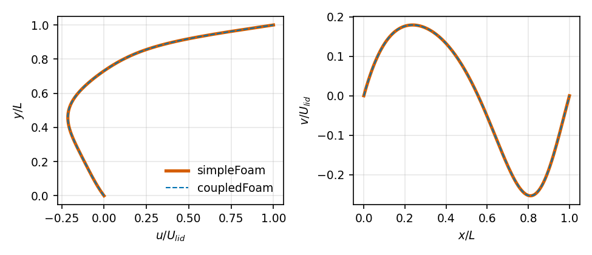
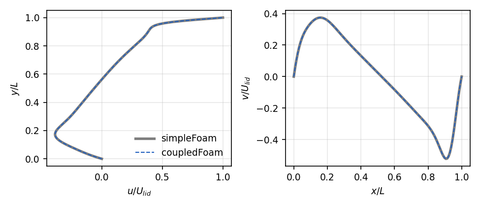
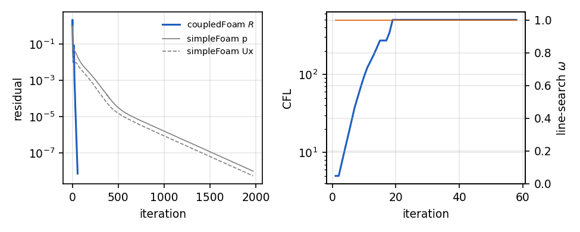
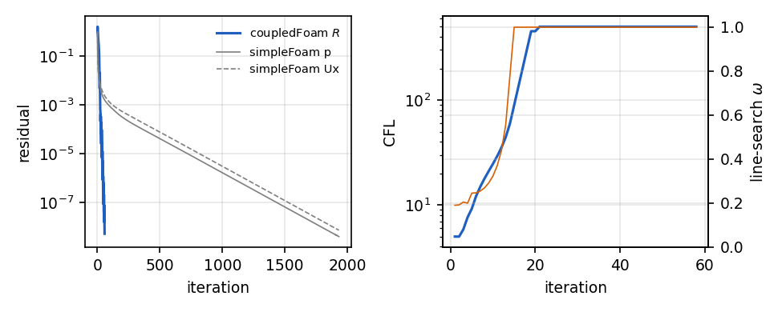

# coupledFoam - Report

Generated by `bench/make_report.py` from `results/` at commit `8ec5dbb`. The LaTeX paper is `report/paper/paper.tex`.

## Executive summary

_No benchmark results yet._

## Method

Block-coupled pressure-velocity solution (4x4 blocks u, v, w, p per cell) with Rhie-Chow interpolation, pseudo-transient continuation with adaptive CFL and physicality line search, two-tier remediation cell sets, single-precision block linear algebra with double-precision residuals and reductions, block-GAMG preconditioned Krylov solvers. Full description: `SPEC_coupledFoam.md`, deviations: `DECISIONS.md`, paper Section 2.

## Correctness and tests

| test | pass | iterations | final R | wall [s] | CPU-h | key metric |
|---|---|---|---|---|---|---|
| T0_Re1000_np1 | yes | 58 | 7.35e-09 | 17.9 | n/a | l2rel_u = 1.43e-05 |
| T0_Re100_np1 | yes | 58 | 5.25e-09 | 9.62 | n/a | l2rel_u = 2.89e-06 |
| Test-block4Ops | yes | n/a | n/a | n/a | n/a | maxInverseError = 6.24e-08 |
| Test-blockGAMG | yes | n/a | n/a | n/a | n/a | crossRankRelDiff = 1.08e-06 |
| Test-blockGAMG_np1 | yes | n/a | n/a | 0.132 | n/a |  |
| Test-blockGAMG_np4 | yes | n/a | n/a | 0.136 | n/a |  |
| Test-blockMatrix | yes | n/a | n/a | n/a | n/a | crossRankRelDiff = 1.71e-09 |
| Test-blockMatrix_np1 | yes | n/a | n/a | n/a | n/a |  |
| Test-blockMatrix_np4 | yes | n/a | n/a | n/a | n/a |  |
| Test-doubleReduce | yes | n/a | n/a | n/a | n/a |  |
| Test-doubleReduce_np1 | yes | n/a | n/a | n/a | n/a | relErrorDouble = 0.00e+00 |
| Test-doubleReduce_np4 | yes | n/a | n/a | n/a | n/a | relErrorDouble = 0.00e+00 |
| Test-precision | yes | n/a | n/a | n/a | n/a |  |
| test_env | yes | n/a | n/a | n/a | n/a |  |


## Linear solver

_No block-GAMG statistics yet._

## Figures



*T0 lid-driven cavity, Re 100: centreline profiles, coupledFoam vs. simpleFoam.*



*T0 lid-driven cavity, Re 1000: centreline profiles, coupledFoam vs. simpleFoam.*



*T0_Re1000_np1: residual, CFL and line-search $\omega$ histories.*



*T0_Re100_np1: residual, CFL and line-search $\omega$ histories.*

## Limitations and Phase 2

See `DECISIONS.md` and the paper, Section 6.

## Reproduction

```
source <openfoam2606>/etc/bashrc
./Allwmake -j 8
~/OF/venv/bin/pytest tests/
bench/run_bench.py
bench/make_report.py
cd report/paper && latexmk -pdf paper.tex
```

## Generator notes

- benchmark: no results yet
- eta/rho history: no data
- cycle comparison: no Test-blockGAMG_cycles result
- Anderson comparison: no configuration G results
- strong scaling: no T-scaling result
- remediation history: no data
- validation table: no T1-T5 results
- GAMG level table: no data
