# coupledFoam - Report

Generated by `bench/make_report.py` from `results/` at commit `ca33547`. The LaTeX paper is `report/paper/paper.tex`.

## Executive summary

_No benchmark results yet._

## Method

Block-coupled pressure-velocity solution (4x4 blocks u, v, w, p per cell) with Rhie-Chow interpolation, pseudo-transient continuation with adaptive CFL and physicality line search, two-tier remediation cell sets, single-precision block linear algebra with double-precision residuals and reductions, block-GAMG preconditioned Krylov solvers. Full description: `SPEC_coupledFoam.md`, deviations: `DECISIONS.md`, paper Section 2.

## Correctness and tests

| test | pass | iterations | final R | wall [s] | CPU-h | key metric |
|---|---|---|---|---|---|---|
| T0_Re1000_np1 | yes | 111 | 9.69e-09 | 26 | 0.00715 | l2rel_u = 1.43e-05 |
| T0_Re1000_np4 | yes | 257 | 5.88e-09 | 70.8 | 0.079 | l2rel_u = 1.41e-05 |
| T0_Re100_np1 | yes | 57 | 4.25e-09 | 5.74 | 0.00171 | l2rel_u = 2.89e-06 |
| T0_Re100_np4 | yes | 57 | 6.7e-09 | 5.72 | 0.00692 | l2rel_u = 2.89e-06 |
| T1_np1 | yes | 400 | 2.75e-06 | 28.1 | 0.00779 | dpRelDiff = 5.72e-04 |
| T1_np4 | yes | 400 | 5.7e-06 | 17.5 | 0.0188 | dpRelDiff = 5.73e-04 |
| T2_np1 | yes | 1000 | 8.89e-06 | 228 | 0.0632 | xrRelDiff = 6.85e-03 |
| T2_np4 | yes | 1000 | 9.06e-06 | 90.4 | 0.1 | xrRelDiff = 6.43e-03 |
| T3_GEKO_np1 | NO | 3000 | 0.000231 | 822 | 0.228 | CdRelDiff = 3.87e-02 |
| T3_kOmegaSST_np1 | NO | 3000 | 0.0149 | 684 | 0.19 | CdRelDiff = 1.16e+00 |
| T4a_np10 | NO | 1500 | n/a | 1.32e+03 | 3.68 | CdRelDiff = 1.76e-02 |
| Test-block4Ops | yes | n/a | n/a | n/a | n/a | maxInverseError = 6.24e-08 |
| Test-blockFGMRES | yes | n/a | n/a | n/a | n/a |  |
| Test-blockGAMG | yes | n/a | n/a | n/a | n/a | crossRankRelDiff = 4.48e-06 |
| Test-blockGAMG_cycles | NO |  | n/a |  | n/a |  |
| Test-blockGAMG_np1 | yes | n/a | n/a | 0.132 | n/a |  |
| Test-blockGAMG_np4 | yes | n/a | n/a | 0.136 | n/a |  |
| Test-blockMatrix | yes | n/a | n/a | n/a | n/a | crossRankRelDiff = 1.71e-09 |
| Test-blockMatrix_np1 | yes | n/a | n/a | n/a | n/a |  |
| Test-blockMatrix_np4 | yes | n/a | n/a | n/a | n/a |  |
| Test-doubleReduce | yes | n/a | n/a | n/a | n/a |  |
| Test-doubleReduce_np1 | yes | n/a | n/a | n/a | n/a | relErrorDouble = 0.00e+00 |
| Test-doubleReduce_np4 | yes | n/a | n/a | n/a | n/a | relErrorDouble = 0.00e+00 |
| Test-precision | yes | n/a | n/a | n/a | n/a |  |
| test_env | yes | n/a | n/a | n/a | n/a |  |

| case | quantity | coupledFoam | simpleFoam | rel. diff. | tolerance | field RMS dU / dp | pass |
|---|---|---|---|---|---|---|---|
| T1_np1 | dp | -5.7287 | -5.7254 | 5.72e-04 | 0.01 |  | yes |
| T2_np1 | x_r/h | 6.4348 | 6.391 | 6.85e-03 | 0.02 |  | yes |
| T3_kOmegaSST_np1 | Cd | -0.014659 | 0.090727 | 1.16e+00 | 0.005 |  | NO |
| T3_kOmegaSST_np1 | Cl | -0.45645 | 0.25267 | 2.81e+00 | 0.005 |  | NO |
| T3_GEKO_np1 | Cd | 0.032969 | 0.034296 | 3.87e-02 | 0.005 |  | NO |
| T3_GEKO_np1 | Cl | 0.91365 | 0.83781 | 9.05e-02 | 0.005 |  | NO |
| T4a_np10† | Cd (mean ± std) | 0.4034 ± 0.0025 | 0.3964 ± 0.0015 | 1.76e-02 | max(2%, 0.002) | 0.49% / 0.11% | NO |
| T4a_np10† | Cl (mean ± std) | 0.0828 ± 0.0028 | 0.0768 ± 0.0017 | 7.83e-02 | max(2%, 0.01) |  | NO |

† Oscillating wake: stationary window mean over the last W = max(300, n/2) iterations (capped at n), mean ± standard deviation; tolerance max(relative, absolute) of the simpleFoam mean (averaged force criterion, D-042 addendum). Field RMS dU / dp: volume-weighted RMS of the mean-velocity difference (magnitude, over U_inf) and of the mean-pressure difference (over the free-stream dynamic pressure) between the solvers, fields averaged over the same window (coupledFieldCompare); proposed limits 2% / 2%; n/a: not evaluated.

## Linear solver

| run | cycle (start/end) | post-sweeps | levels | mergeLevels | C_op | cells per level | ranks per level | coarsening ratios | coarsest solver |
|---|---|---|---|---|---|---|---|---|---|
| T0_Re1000_np1 | K/K | 2/2 | 4 | 2 | 1.325 | 16384 4096 1024 256 | 1 1 1 1 | 4 4 4 | blockBiCGStab |
| T0_Re1000_np4 | K/K | 2/2 | 3 | 2 | 1.310 | 16384 4096 1024 | 4 1 1 | 4 4 | blockBiCGStab |
| T0_Re100_np1 | K/K | 2/2 | 4 | 2 | 1.325 | 16384 4096 1024 256 | 1 1 1 1 | 4 4 4 | blockBiCGStab |
| T0_Re100_np4 | K/K | 2/2 | 3 | 2 | 1.361 | 16384 4082 1008 | 4 1 1 | 4.01 4.05 | blockBiCGStab |
| T1_np1 | V/V | 2/2 | 4 | 2 | 1.412 | 12225 3052 754 373 | 1 1 1 1 | 4.03 4.07 2.03 | blockBiCGStab |
| T1_np4 | V/V | 2/2 | 3 | 2 | 1.446 | 12225 3049 1518 | 4 1 1 | 4.03 2.02 | blockBiCGStab |
| T2_np1 | V/V | 2/2 | 4 | 2 | 1.401 | 20540 5128 1267 299 | 1 1 1 1 | 4.02 4.07 4.2 | blockBiCGStab |
| T2_np4 | V/V | 2/2 | 3 | 2 | 1.371 | 20540 5117 1245 | 4 1 1 | 4.02 4.1 | blockBiCGStab |
| T3_GEKO_np1 | K/K | 2/4 | 3 | 3 | 1.205 | 10720 1330 328 | 1 1 1 | 8.06 4.05 | blockBiCGStab |
| T3_kOmegaSST_np1 | K/K | 2/4 | 3 | 3 | 1.205 | 10720 1330 328 | 1 1 1 | 8.06 4.05 | blockBiCGStab |
| T4a_np10 | V/V | 2/2 | 4 | 3 | 1.248 | 354198 39829 4579 2238 | 10 2 1 1 | 8.89 8.7 2.05 | blockBiCGStab |

## Amendment B10 acceptance

_No E/F/G/H benchmark results yet._

## Figures


*T0 lid-driven cavity, Re 100: centreline profiles, coupledFoam vs. simpleFoam.*


*T0 lid-driven cavity, Re 1000: centreline profiles, coupledFoam vs. simpleFoam.*


*T0_Re1000_np1: residual, CFL and line-search $\omega$ histories.*

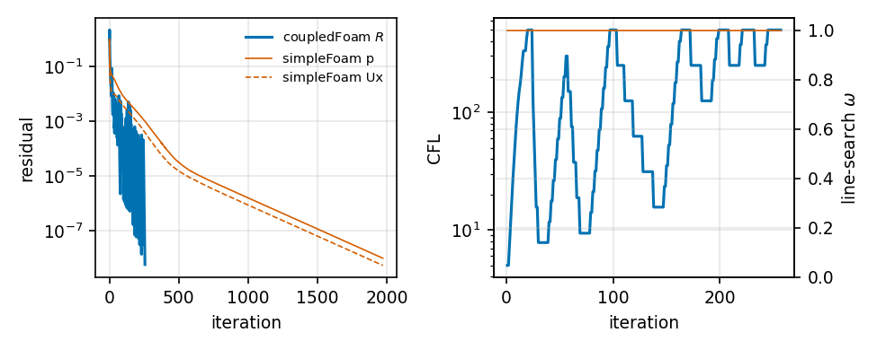

*T0_Re1000_np4: residual, CFL and line-search $\omega$ histories.*


*T0_Re100_np1: residual, CFL and line-search $\omega$ histories.*

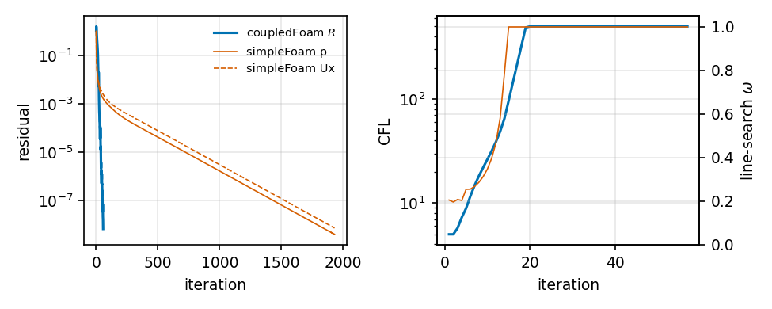

*T0_Re100_np4: residual, CFL and line-search $\omega$ histories.*

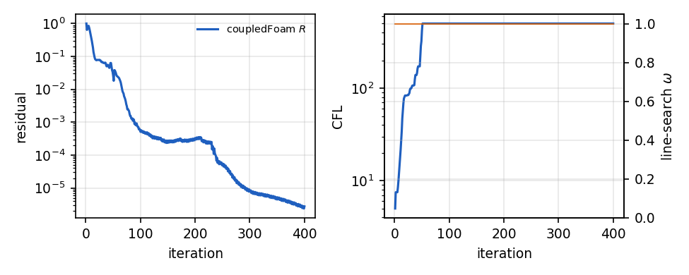

*T1_np1: residual, CFL and line-search $\omega$ histories.*

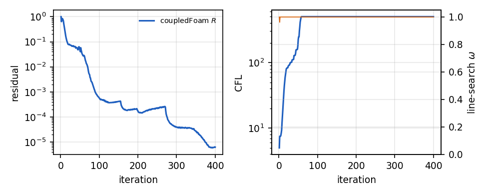

*T1_np4: residual, CFL and line-search $\omega$ histories.*

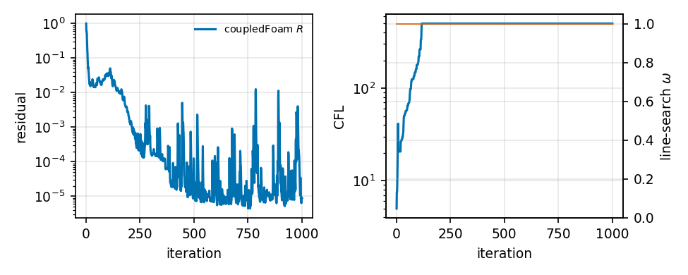

*T2_np1: residual, CFL and line-search $\omega$ histories.*

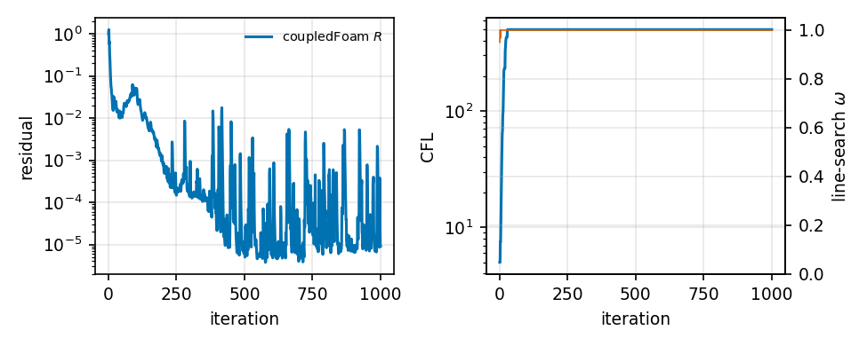

*T2_np4: residual, CFL and line-search $\omega$ histories.*

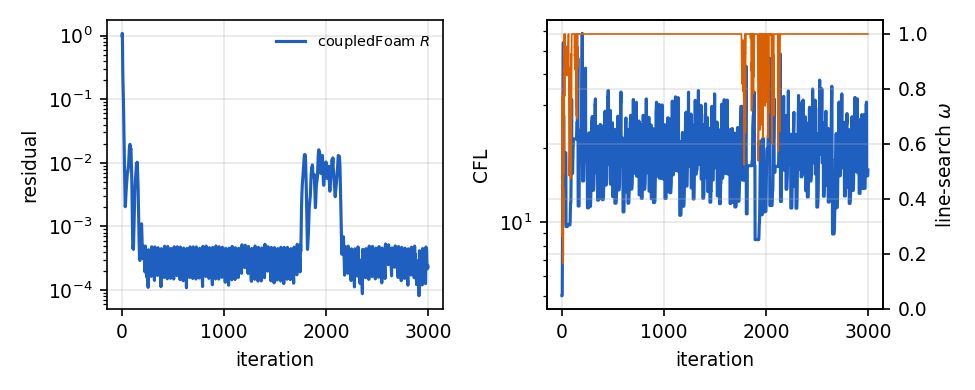

*T3_GEKO_np1: residual, CFL and line-search $\omega$ histories.*

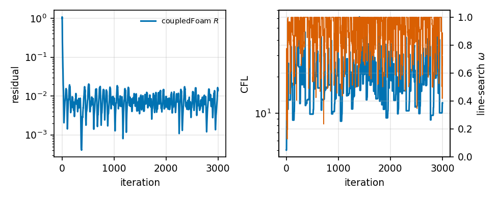

*T3_kOmegaSST_np1: residual, CFL and line-search $\omega$ histories.*

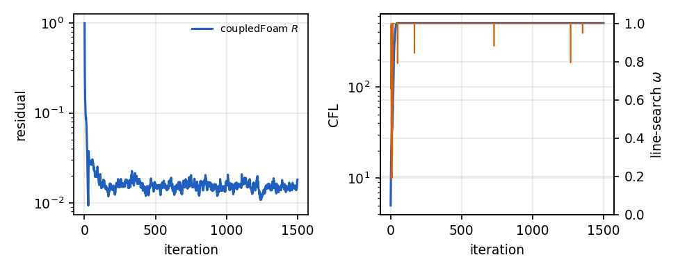

*T4a_np10: residual, CFL and line-search $\omega$ histories.*

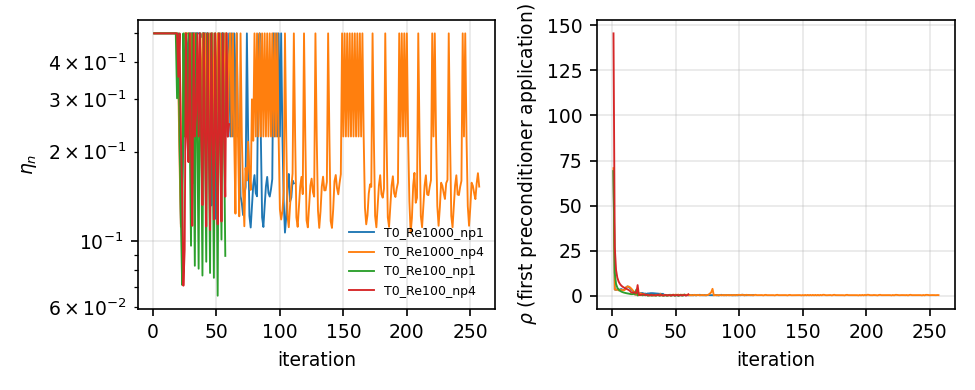

*Eisenstat-Walker forcing term and preconditioner efficiency; dotted lines: autoTune events.*

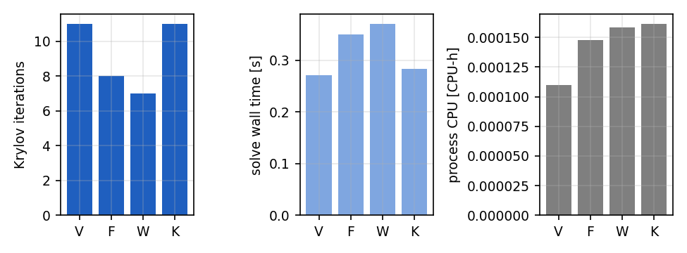

*Unit test: block-GAMG cycle types on the block-Poisson system (T0 cavity mesh, serial).*

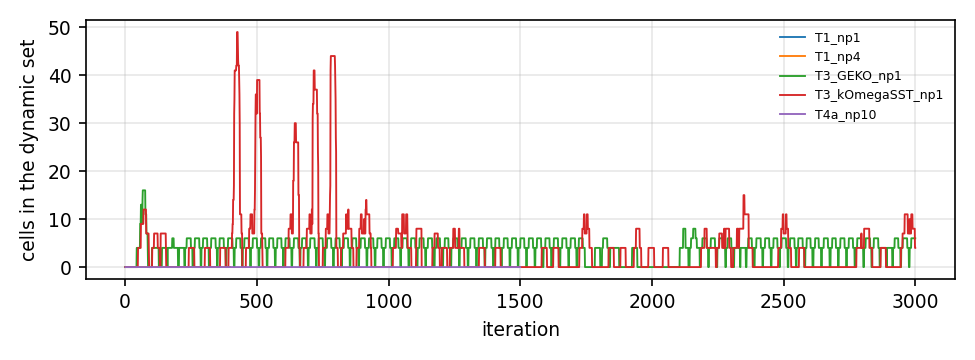

*Dynamic remediation set size.*

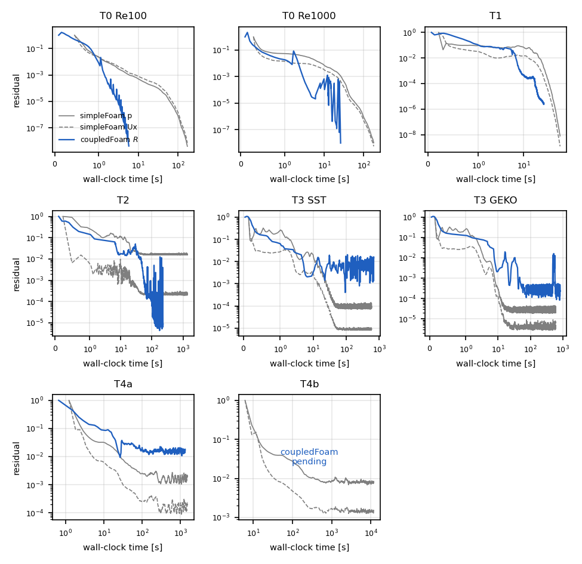

*Residual against wall-clock time on the same axes: coupledFoam combined residual $R$ (blue) and simpleFoam initial residuals of $p$ and $U_x$ (grey). The two residual normalisations differ (Section 3.2); the time axis is the comparable quantity.*

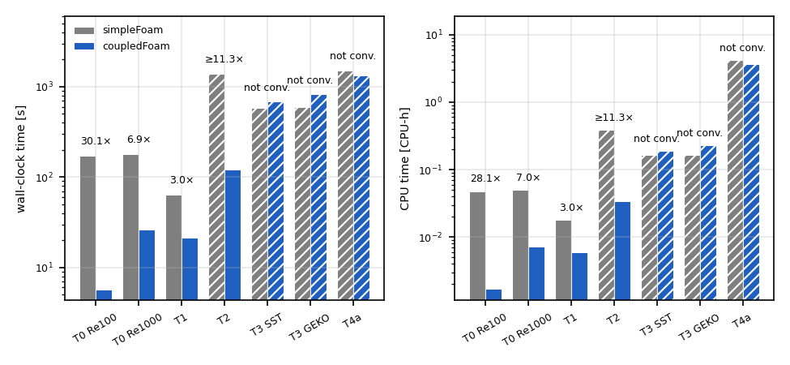

*Wall-clock time (left) and CPU-hours (right) to convergence, simpleFoam (grey) and coupledFoam (blue), serial runs; numbers: speed-up simpleFoam/coupledFoam. Hatched: the run did not reach its criterion, the bar is the whole run (for simpleFoam a lower bound, so the speed-up is marked $\geq$).*

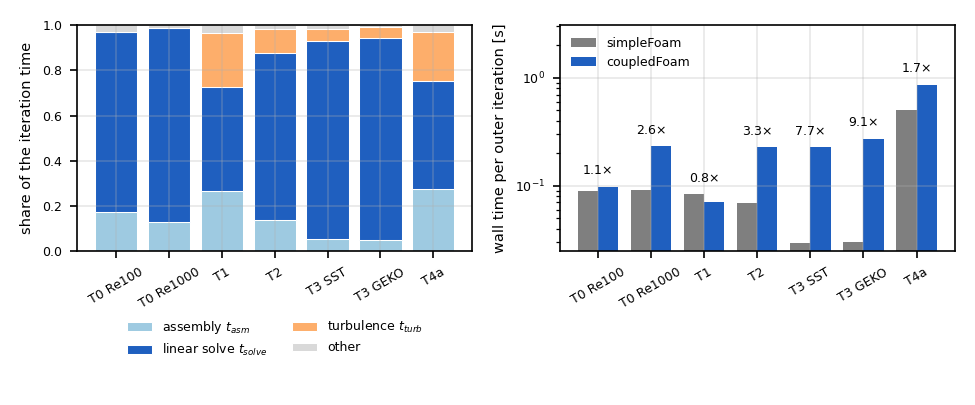

*coupledFoam time per outer iteration: share of assembly, linear solve and turbulence (left, mean over the run); wall time per iteration of both solvers with the cost ratio coupledFoam/simpleFoam (right).*

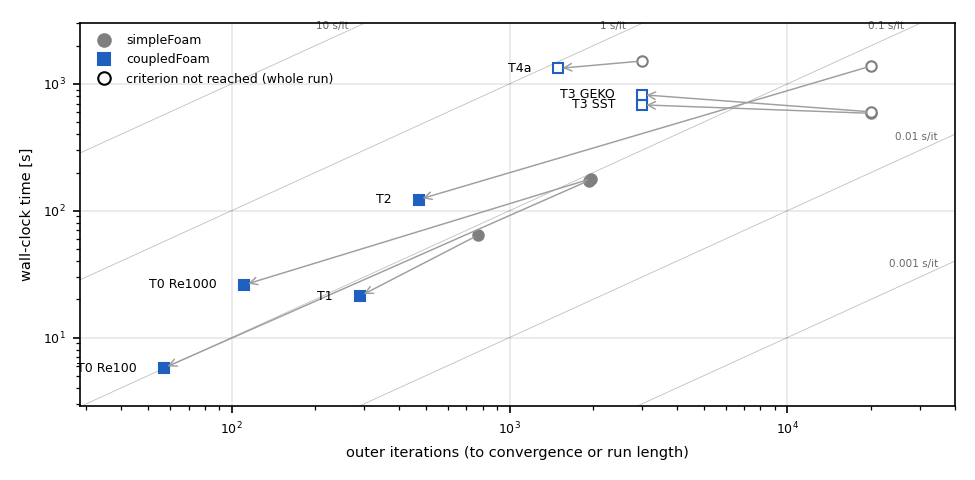

*Iterations against wall-clock time: each arrow goes from simpleFoam to coupledFoam for one case. Diagonal lines are constant time per iteration; coupledFoam moves far to the left (fewer iterations) and up to a more expensive diagonal. It is faster where the arrow points down.*

- `paper/figures/fields_T0_Re100_U.pdf`: T0 lid-driven cavity, Re 100: velocity magnitude $|U|/U_{ref}$ with streamlines; left/top coupledFoam, middle simpleFoam (identical colour scale), right/bottom the difference coupledFoam$-$simpleFoam (area-weighted RMS 4.4e-05, max 4.1e-03).
- `paper/figures/fields_T0_Re100_p.pdf`: T0 lid-driven cavity, Re 100: pressure coefficient $C_p=(p-p_0)/(\tfrac12 U_{ref}^2)$; left/top coupledFoam, middle simpleFoam (identical colour scale), right/bottom the difference coupledFoam$-$simpleFoam (area-weighted RMS 1.2e-03, max 2.0e-01).
- `paper/figures/fields_T0_Re1000_U.pdf`: T0 lid-driven cavity, Re 1000: velocity magnitude $|U|/U_{ref}$ with streamlines; left/top coupledFoam, middle simpleFoam (identical colour scale), right/bottom the difference coupledFoam$-$simpleFoam (area-weighted RMS 3.6e-05, max 3.1e-03).
- `paper/figures/fields_T0_Re1000_p.pdf`: T0 lid-driven cavity, Re 1000: pressure coefficient $C_p=(p-p_0)/(\tfrac12 U_{ref}^2)$; left/top coupledFoam, middle simpleFoam (identical colour scale), right/bottom the difference coupledFoam$-$simpleFoam (area-weighted RMS 9.3e-05, max 1.4e-02).
- `paper/figures/fields_T1_U.pdf`: T1 pitzDaily: velocity magnitude $|U|/U_{ref}$ with streamlines; left/top coupledFoam, middle simpleFoam (identical colour scale), right/bottom the difference coupledFoam$-$simpleFoam (area-weighted RMS 7.0e-05, max 1.5e-03).
- `paper/figures/fields_T1_p.pdf`: T1 pitzDaily: pressure coefficient $C_p=(p-p_0)/(\tfrac12 U_{ref}^2)$; left/top coupledFoam, middle simpleFoam (identical colour scale), right/bottom the difference coupledFoam$-$simpleFoam (area-weighted RMS 1.4e-04, max 9.3e-04).
- `paper/figures/profiles_T1.pdf`: T1 pitzDaily: streamwise velocity profiles at stations $x/h$; simpleFoam thick grey, coupledFoam dashed blue.
- `paper/figures/fields_T2_U.pdf`: T2 backward-facing step: velocity magnitude $|U|/U_{ref}$ with streamlines; left/top coupledFoam, middle simpleFoam (identical colour scale), right/bottom the difference coupledFoam$-$simpleFoam (area-weighted RMS 1.1e-03, max 1.5e-01).
- `paper/figures/fields_T2_p.pdf`: T2 backward-facing step: pressure coefficient $C_p=(p-p_0)/(\tfrac12 U_{ref}^2)$; left/top coupledFoam, middle simpleFoam (identical colour scale), right/bottom the difference coupledFoam$-$simpleFoam (area-weighted RMS 3.7e-04, max 1.7e-02).
- `paper/figures/profiles_T2.pdf`: T2 backward-facing step: streamwise velocity profiles at stations $x/h$, lower-wall skin friction $C_f$; simpleFoam thick grey, coupledFoam dashed blue.
- `paper/figures/fields_T3_kOmegaSST_U.pdf`: T3 airFoil2D, k-omega SST: velocity magnitude $|U|/U_{ref}$ with streamlines; left/top coupledFoam, middle simpleFoam (identical colour scale), right/bottom the difference coupledFoam$-$simpleFoam (area-weighted RMS 5.4e-02, max 1.0e+00).
- `paper/figures/fields_T3_kOmegaSST_p.pdf`: T3 airFoil2D, k-omega SST: pressure coefficient $C_p=(p-p_0)/(\tfrac12 U_{ref}^2)$; left/top coupledFoam, middle simpleFoam (identical colour scale), right/bottom the difference coupledFoam$-$simpleFoam (area-weighted RMS 4.3e-02, max 9.4e-01).
- `paper/figures/profiles_T3_kOmegaSST.pdf`: T3 airFoil2D, k-omega SST: surface pressure coefficient; simpleFoam thick grey, coupledFoam dashed blue.
- `paper/figures/fields_T3_GEKO_U.pdf`: T3 airFoil2D, GEKO: velocity magnitude $|U|/U_{ref}$ with streamlines; left/top coupledFoam, middle simpleFoam (identical colour scale), right/bottom the difference coupledFoam$-$simpleFoam (area-weighted RMS 4.5e-03, max 4.0e-01).
- `paper/figures/fields_T3_GEKO_p.pdf`: T3 airFoil2D, GEKO: pressure coefficient $C_p=(p-p_0)/(\tfrac12 U_{ref}^2)$; left/top coupledFoam, middle simpleFoam (identical colour scale), right/bottom the difference coupledFoam$-$simpleFoam (area-weighted RMS 3.2e-03, max 1.8e-01).
- `paper/figures/profiles_T3_GEKO.pdf`: T3 airFoil2D, GEKO: surface pressure coefficient; simpleFoam thick grey, coupledFoam dashed blue.
- `paper/figures/hist_T0_Re100_np1_residuals.pdf`: T0 cavity, Re 100, 1 rank: residuals history
- `paper/figures/hist_T0_Re100_np1_wall.pdf`: T0 cavity, Re 100, 1 rank: wall history
- `paper/figures/hist_T0_Re100_np1_linear.pdf`: T0 cavity, Re 100, 1 rank: linear history
- `paper/figures/hist_T0_Re100_np4_residuals.pdf`: T0 cavity, Re 100, 4 ranks: residuals history
- `paper/figures/hist_T0_Re100_np4_wall.pdf`: T0 cavity, Re 100, 4 ranks: wall history
- `paper/figures/hist_T0_Re100_np4_linear.pdf`: T0 cavity, Re 100, 4 ranks: linear history
- `paper/figures/hist_T0_Re1000_np1_residuals.pdf`: T0 cavity, Re 1000, 1 rank: residuals history
- `paper/figures/hist_T0_Re1000_np1_wall.pdf`: T0 cavity, Re 1000, 1 rank: wall history
- `paper/figures/hist_T0_Re1000_np1_linear.pdf`: T0 cavity, Re 1000, 1 rank: linear history
- `paper/figures/hist_T0_Re1000_np4_residuals.pdf`: T0 cavity, Re 1000, 4 ranks: residuals history
- `paper/figures/hist_T0_Re1000_np4_wall.pdf`: T0 cavity, Re 1000, 4 ranks: wall history
- `paper/figures/hist_T0_Re1000_np4_linear.pdf`: T0 cavity, Re 1000, 4 ranks: linear history
- `paper/figures/hist_T1_np1_loads.pdf`: T1 pitzDaily, 1 rank: loads history
- `paper/figures/hist_T1_np1_residuals.pdf`: T1 pitzDaily, 1 rank: residuals history
- `paper/figures/hist_T1_np1_wall.pdf`: T1 pitzDaily, 1 rank: wall history
- `paper/figures/hist_T1_np1_linear.pdf`: T1 pitzDaily, 1 rank: linear history
- `paper/figures/hist_T1_np4_loads.pdf`: T1 pitzDaily, 4 ranks: loads history
- `paper/figures/hist_T1_np4_residuals.pdf`: T1 pitzDaily, 4 ranks: residuals history
- `paper/figures/hist_T1_np4_wall.pdf`: T1 pitzDaily, 4 ranks: wall history
- `paper/figures/hist_T1_np4_linear.pdf`: T1 pitzDaily, 4 ranks: linear history
- `paper/figures/hist_T2_np1_loads.pdf`: T2 backward-facing step, 1 rank: loads history
- `paper/figures/hist_T2_np1_residuals.pdf`: T2 backward-facing step, 1 rank: residuals history
- `paper/figures/hist_T2_np1_wall.pdf`: T2 backward-facing step, 1 rank: wall history
- `paper/figures/hist_T2_np1_linear.pdf`: T2 backward-facing step, 1 rank: linear history
- `paper/figures/hist_T2_np4_loads.pdf`: T2 backward-facing step, 4 ranks: loads history
- `paper/figures/hist_T2_np4_residuals.pdf`: T2 backward-facing step, 4 ranks: residuals history
- `paper/figures/hist_T2_np4_wall.pdf`: T2 backward-facing step, 4 ranks: wall history
- `paper/figures/hist_T2_np4_linear.pdf`: T2 backward-facing step, 4 ranks: linear history
- `paper/figures/hist_T3_kOmegaSST_np1_loads.pdf`: T3 airFoil2D, SST: loads history
- `paper/figures/hist_T3_kOmegaSST_np1_residuals.pdf`: T3 airFoil2D, SST: residuals history
- `paper/figures/hist_T3_kOmegaSST_np1_wall.pdf`: T3 airFoil2D, SST: wall history
- `paper/figures/hist_T3_kOmegaSST_np1_linear.pdf`: T3 airFoil2D, SST: linear history
- `paper/figures/hist_T3_GEKO_np1_loads.pdf`: T3 airFoil2D, GEKO: loads history
- `paper/figures/hist_T3_GEKO_np1_residuals.pdf`: T3 airFoil2D, GEKO: residuals history
- `paper/figures/hist_T3_GEKO_np1_wall.pdf`: T3 airFoil2D, GEKO: wall history
- `paper/figures/hist_T3_GEKO_np1_linear.pdf`: T3 airFoil2D, GEKO: linear history
- `paper/figures/hist_T4a_np10_loads.pdf`: T4a motorBike, 354k cells, 10 ranks: loads history
- `paper/figures/hist_T4a_np10_residuals.pdf`: T4a motorBike, 354k cells, 10 ranks: residuals history
- `paper/figures/hist_T4a_np10_wall.pdf`: T4a motorBike, 354k cells, 10 ranks: wall history
- `paper/figures/hist_T4a_np10_linear.pdf`: T4a motorBike, 354k cells, 10 ranks: linear history
- `paper/figures/hist_T4b_np10_loads.pdf`: T4b motorBike, 1.70M cells, 10 ranks: loads history
- `paper/figures/hist_T4b_np10_residuals.pdf`: T4b motorBike, 1.70M cells, 10 ranks: residuals history
- `paper/figures/hist_T4b_np10_wall.pdf`: T4b motorBike, 1.70M cells, 10 ranks: wall history
- `paper/figures/hist_T4b_np10_linear.pdf`: T4b motorBike, 1.70M cells, 10 ranks: linear history

3D renders (ParaView, `bench/render_fields.py`): `paper/figures/render_*.png`.

## Limitations and Phase 2

See `DECISIONS.md` and the paper, Section 6.

## Reproduction

```
source <openfoam2606>/etc/bashrc
./Allwmake -j 8
~/OF/venv/bin/pytest tests/
bench/run_bench.py
bench/exploratory_numbers.py
bench/make_report.py
cd report/paper && latexmk -pdf paper.tex
```

## Generator notes

- benchmark: no results yet
- cycle comparison: no Test-blockGAMG_cycles_motorBike result
- benchmark cycle comparison: no configuration E results
- Anderson comparison: no configuration G results
- strong scaling: no T-scaling result
- B10 acceptance: no E/F/G/H benchmark results
- 3D renders: T4b: run/ref_T4b_np10 or run/T4b_np10 is being written, case skipped (previous renders kept)
- 3D renders: T5: run/ref_T5_np10 missing, skipped
- histories T4a_np10: coupledFoam run T4a_np10 is being written, skipped
- histories T4b_np10: coupledFoam run T4b_np10 is being written, skipped
